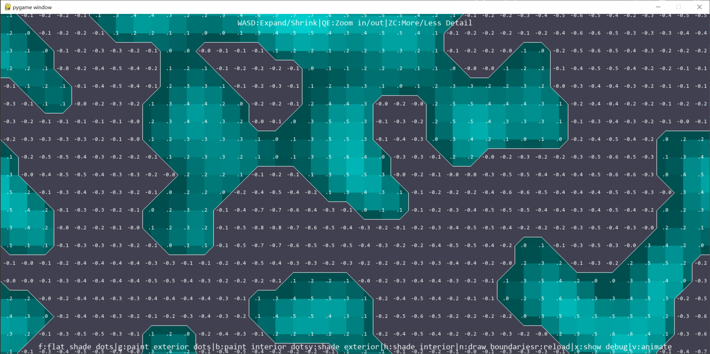

# Marching Squares test

An implementation of binary marching squares
## Setup
### Requirements
Pygame 2.4.0
Python 3.9.12
### Installation
Clone this repository and run in folder using `python app.py` or `python3 app.py`.

## Controls
* F - Flat shade dots
* G - Paint exterior dots
* V - Paint interior dots
* H - Shade interior
* R - Reload
* X - Show debug
* W/S - Shrink Expand Y Axis
* A/D - Shrink/Expand on the X Axis
* Q/E - Zoom in/out

## Todo
* Use simplex or perlin noise to generate maps
* Add relative boundary shaping
* Consider moving to 3D increased complexity 28 combinations.